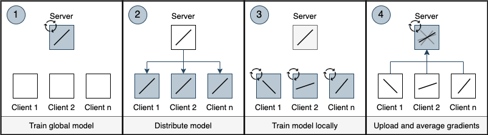

# Federated Learning

## Introduction
A classic machine learning approach would require the parties to assemble their datasets in a central location and train a unique machine learning model, exposing the data to each other and the central server. On the contrary, through federated learning, data owners can train a model iteratively without the need to disclose their data. Therefore, Federated Learning provides privacy by design.

## Technical Information
In the original FedAVG implementation by McMahan et al. [1], this model is learned through stochastic gradient descent (SGD), where each party computes the average gradient on its local data at the current model and iterates multiple times over the update. The party submits then the gradients to the central server, which aggregates the updates from all parties. More specifically, the FedML protocol can be divided into four distinct steps.

1. The server or model owner chooses an initial global model suitable for the use case and underlying data structure. The global model can be initially trained on the data set of the server.
2. The server distributes the global model amongst all clients. 
3. Every client individually trains the model locally on their own data and stores the resulting update gradients. Hence, after the training process every client owns its individually adapted machine learning model based on their dataset.
4. The clients send the individually stored update gradients back to the server. The server aggregates the received gradients based on a pre-defined protocol and updates the global model based on these aggregates. Therefore, the server now has a global machine learning model, which was trained on the data of multiple clients while never being able to observe the actual data.

### Participant Roles
Data Engineers, Data Scientists, Software Engineers

### Building Blocks
1. Central Server: Building the global model and aggregating the gradients.
2. Local Data Contributors: Preparing the data as specified, training the local model and sending the gradients.
3. Orchestration Component: To orchestrate the training procedure, communication, gradient exchange and model exchange.
4. Typical ML Infrastructure: Data processing pipelines, model training pipelines (, optionally deployment infrastructure)

## Evaluation
This section provides an overview of the advantages and drawback of using Federated Machine Learning in contrast to traditional ML approaches.

### Advantages
1. Privacy by design: The data is never completely exposed since data never leaves its owners' device and all computation is performed locally.
2. Communication Efficiency: Since Federated Learning follows a model-to-data approach there is no need to exchange full datasets. Only communicating the models and update gradients is more communication efficient.
3. Overcoming Data Silos: Since the ML model can be trained in a decentralized and privacy-enhancing manner, Federated Machine Learning yields the potential to break up data silos and overcome the ever-persisting bottleneck of insufficient training data.
4. Offline Usage: The models can be used offline and real-time by the users since the model is brought to the data. There is no need to communicate with a central server.
5. Hardware Efficiency: Federated Learning usess less complex hardware, because models do not need a complex central server to analyze data.

### Drawbacks
1. System Heterogeneity: Real-world settings often have to deal with inconsistent, heterogeneous and inconsistent input data, labels and hardware settings. Current Federated Learning approaches usually have difficulties dealing with inconsistent data.
2. Scalability: The communication overhead of this protocol currently restricts scaling the number of participants in practical FedML systems. A larger number of clients additionally implies a higher data load and higher risk of heterogeneous systems.
3. Privacy: The privacy-by-design features of FedML does not cover all privacy-related issues around machine learning. E.g. re-identification attacks by reverse-engineering the update gradients are still possible, but highly unlikely and expensive.
4. Hardware Restrictions: In most cases, the clients’ hardware can not be changed and hence FedML systems have to deal with the provided hardware on the client side.

## Technological Readiness Level
5: The technology is in the transition from research and development to productization.

### References
\[1\] McMahan, H.B., Moore, E., Ramage, D., Hampson, S., & Arcas, B.A. (2017). Communication-Efficient Learning of Deep Networks from Decentralized Data. AISTATS.
